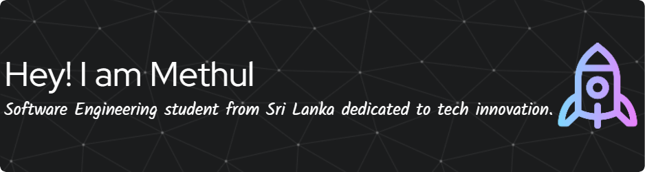

# 💫 About Me:

👋 Hi, I'm Methul!  

💻 Computer Science Student | Aspiring Software QA Engineer | Developer 
🧪 Passionate about Software Testing, Quality Assurance, and delivering reliable software solutions. 
🔍 Exploring Manual Testing, Automation Testing, API Testing, and Software Quality Engineering practices. 
🤖 Interested in AI and emerging technologies. 
💡 Building and testing innovative projects while focusing on quality, performance, and user experience.  

📬 Connect with Me: 
📩 [methul_silva@protonmail.com](mailto:methul_silva@protonmail.com) 
🔗 https://www.linkedin.com/in/methul-silva-8264aa293/  

✨ "Learn. Test. Improve. Build better software." 🚀

# 💻 Tech Stack:

## 👨‍💻 Programming Languages

---

## 🧪 Automation Testing

---

## 🔄 DevOps / CI-CD

---

## 🧑‍💻 Version Control

---

## 🗄️ Databases

---

## 📊 Data Science / ML Tools

---

## 🎨 Design Tools

### ✍️ Random Dev Quote

---

<!-- Proudly created with GPRM ( https://gprm.itsvg.in ) -->
